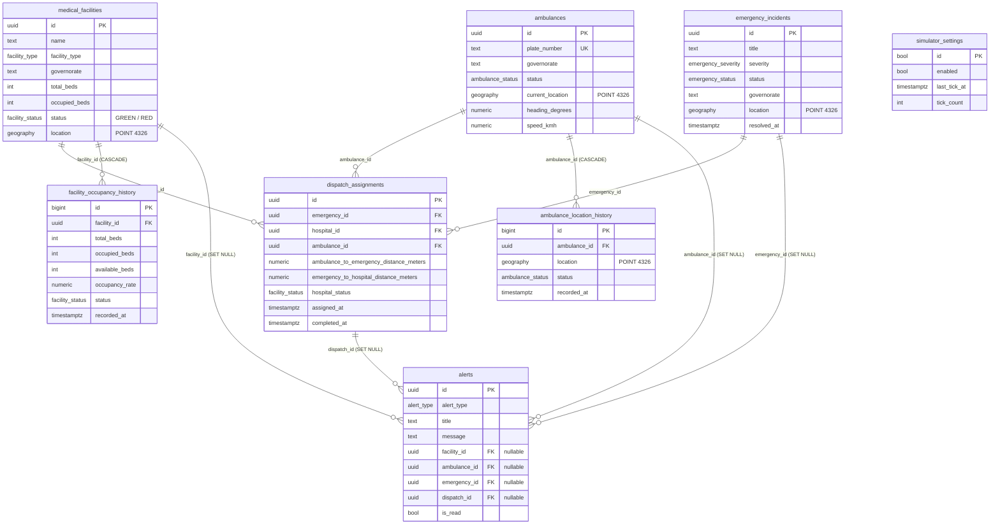

<div align="center">

# لوحة المراقبة الطبية الجغرافية في سوريا
### Syria Medical GIS Dashboard

**غرفة عمليات طبية جغرافية حيّة — المشافي وسيارات الإسعاف والحوادث الطارئة والتوجيه، في الزمن الحقيقي.**


_%2F_إنجليزي-2E7D32)

</div>

---

## 📋 نظرة عامة

مشروع **إثبات مفهوم (Proof of Concept)** جاهز للعرض، يُحاكي غرفة عمليات طبية سورية. يعرض خريطة جغرافية (GIS) حيّة للمشافي وأسطول سيارات الإسعاف والحوادث الطارئة، مع **توجيه إسعاف مدفوع من قاعدة البيانات**، ومراقبة إشغال المشافي، وإعادة تشغيل تاريخية، ودعم كامل للغتين **العربية (الافتراضية، من اليمين لليسار)** و**الإنجليزية (من اليسار لليمين)**.

> **المبدأ التصميمي الأساسي:** المتصفح **لا** يحسب المسافات، و**لا** يختار سيارة الإسعاف، و**لا** يشتقّ حالة الإشغال. هو فقط يقرأ *Views* من قاعدة البيانات، ويستدعي دوال *RPC*، ويعرض النتيجة. كل المنطق الموثوق يعيش داخل PostgreSQL/PostGIS.

---

## ✨ أهم الميزات

- 🗺️ **خريطة GIS حيّة** — مبنية على Leaflet مع تجميع العلامات (clustering)، مشافٍ ملوّنة حسب الحالة، سيارات إسعاف متحركة، وخطوط توجيه مرسومة.
- 🚑 **توجيه إسعاف من قاعدة البيانات** — PostgreSQL يختار ويقفل أقرب سيارة إسعاف متاحة؛ وحالات الفشل تُعرَض برسائل صريحة ومنفصلة.
- 🏥 **مراقبة الإشغال** — حالة المشفى (أخضر GREEN / أحمر RED) تُحسَب عبر *Trigger* في قاعدة البيانات (`> 90%` = أحمر).
- 📡 **مزامنة لحظية (Realtime)** — قناة Supabase واحدة تُستخدم كإشارة "إبطال" فقط؛ اللوحة تعيد قراءة اللقطة الموثوقة دائماً، فلا يمكن لانقطاع الاتصال أن يترك بيانات قديمة على الشاشة.
- 🕓 **إعادة تشغيل تاريخية** — اختر أي وقت سابق لعرض لقطة زمنية دقيقة؛ تُعطَّل فيها إجراءات التوجيه ولا تُخلَط البيانات الحيّة بالتاريخية.
- 🔁 **محاكي مدمج** — مهمة `pg_cron` تُحرّك الأسطول والإشغال والحوادث كل 5 ثوانٍ لعرض ذاتي الحركة.
- 🌍 **واجهة ثنائية اللغة بالكامل** — العربية أولاً (RTL) والإنجليزية (LTR) مع أرقام وتواريخ حسب اللغة.

---

## 🛠️ التقنيات المستخدمة

| الطبقة | التقنية |
| --- | --- |
| الواجهة | React 19، TanStack Router / Start (تصيير من الخادم SSR)، Vite 8، TypeScript |
| التنسيق | Tailwind CSS v4، shadcn/ui (مبنية على Radix)، أيقونات Lucide |
| الخرائط | Leaflet، react-leaflet، react-leaflet-cluster |
| البيانات والحالة | TanStack Query، عميل Supabase |
| الواجهة الخلفية | PostgreSQL 15 + PostGIS 3.3، Supabase (Realtime، RPC، RLS) |
| اللغات | مزوّد i18n خفيف مخصّص (عربي RTL افتراضي + إنجليزي LTR) |

> **ملاحظة حول البناء:** منظومة البناء (Vite/SSR) مُجمّعة عبر حزمة `@lovable.dev/vite-tanstack-config` (انظر [`vite.config.ts`](vite.config.ts)). هذه الحزمة الواحدة تربط TanStack Start و Nitro و Tailwind ومسارات الاستيراد وحقن متغيرات البيئة، وهي **مطلوبة** لكي يعمل المشروع ويُبنى.

---

## 🗂️ هيكل المشروع (شرح كل ملف)

### الجذر (الملفات الرئيسية)

| الملف | الوصف |
| --- | --- |
| [`package.json`](package.json) | تبعيات المشروع وأوامر التشغيل (`dev`، `build`، `lint`، `format`) |
| [`vite.config.ts`](vite.config.ts) | إعداد Vite/SSR عبر حزمة Lovable — يوجّه نقطة دخول الخادم إلى `src/server.ts` |
| [`tsconfig.json`](tsconfig.json) | إعداد TypeScript (وضع صارم، مسار الاختصار `@/*`) |
| [`eslint.config.js`](eslint.config.js) | قواعد فحص الكود (ESLint + Prettier) |
| `components.json` | إعداد shadcn/ui لتوليد المكوّنات |
| `.env` | متغيّرات البيئة (رابط Supabase والمفتاح العلني) — **لا تُرفَع الأسرار الحقيقية** |
| `bunfig.toml` / `bun.lock` | إعداد وقفل حزم مدير الحزم Bun |
| `.prettierrc` / `.prettierignore` | إعداد منسّق الكود Prettier |
| [`README.md`](README.md) | هذا الملف |

### `src/` — الشيفرة المصدرية

#### 🚏 المسارات (Routes) والدخول

| الملف | الوصف |
| --- | --- |
| [`src/routes/__root.tsx`](src/routes/__root.tsx) | **الغلاف الجذري** للتطبيق: قالب HTML، مزوّدات (QueryClient و i18n)، حدود الأخطاء (Error Boundary)، وصفحة 404 |
| [`src/routes/index.tsx`](src/routes/index.tsx) | **الصفحة الرئيسية / اللوحة**: مؤشّرات KPI، الفلاتر، الخريطة، لوحة العمليات، التنبيهات، وتدفّق التوجيه |
| [`src/router.tsx`](src/router.tsx) | إنشاء موجّه TanStack وربط `QueryClient` |
| [`src/routeTree.gen.ts`](src/routeTree.gen.ts) | شجرة المسارات المُولَّدة تلقائياً — **لا يُعدَّل يدوياً** |
| [`src/server.ts`](src/server.ts) | غلاف SSR الذي يلتقط الأخطاء ويعرض صفحة خطأ نظيفة |
| [`src/start.ts`](src/start.ts) | نقطة انطلاق TanStack Start |
| [`src/styles.css`](src/styles.css) | أنماط Tailwind العامة ومتغيّرات الألوان (الثيم) |

#### 🗺️ مكوّنات الخريطة

| الملف | الوصف |
| --- | --- |
| [`src/components/map/MapPanel.tsx`](src/components/map/MapPanel.tsx) | غلاف الخريطة الذي يُحمَّل على العميل فقط (Leaflet لا يعمل على الخادم) |
| [`src/components/map/OpsMap.tsx`](src/components/map/OpsMap.tsx) | خريطة العمليات الفعلية: العلامات، التجميع، خطوط التوجيه، والتركيز على عنصر |
| [`src/components/map/markerIcons.ts`](src/components/map/markerIcons.ts) | تعريف أيقونات العلامات (مشفى / إسعاف / حادث) حسب الحالة |

#### 🎨 مكوّنات الواجهة

| المسار | الوصف |
| --- | --- |
| `src/components/ui/*.tsx` | مكتبة مكوّنات **shadcn/ui** (زر، بطاقة، حوار، تبويبات، قوائم…) — مكوّنات عامة قابلة لإعادة الاستخدام مبنية على Radix |

#### 🧠 الخدمات (الطبقة الوحيدة التي تتحدث مع قاعدة البيانات)

| الملف | الوصف |
| --- | --- |
| [`src/services/supabase.ts`](src/services/supabase.ts) | تصدير عميل Supabase المُشترَك |
| [`src/services/medical.service.ts`](src/services/medical.service.ts) | قراءة الـ *Views* وتحويلها إلى صفوف مُنمَّطة + تجميع لقطة اللوحة (`fetchDashboardSnapshot`) |
| [`src/services/dispatch.service.ts`](src/services/dispatch.service.ts) | استدعاء `process_emergency_routing` و `complete_dispatch` وتصنيف أخطاء التوجيه |
| [`src/services/history.service.ts`](src/services/history.service.ts) | جلب اللقطة التاريخية عبر `get_historical_snapshot` |
| [`src/services/simulator.service.ts`](src/services/simulator.service.ts) | قراءة حالة المحاكي وتفعيله/إيقافه |

#### 🔌 التكامل مع Supabase

| الملف | الوصف |
| --- | --- |
| [`src/integrations/supabase/client.ts`](src/integrations/supabase/client.ts) | عميل Supabase لجهة العميل (المتصفح) — يدعم مفاتيح API الجديدة |
| [`src/integrations/supabase/client.server.ts`](src/integrations/supabase/client.server.ts) | عميل Supabase لجهة الخادم (SSR) |
| [`src/integrations/supabase/auth-middleware.ts`](src/integrations/supabase/auth-middleware.ts) | وسيط للتحقق من رموز المصادقة على الخادم |
| [`src/integrations/supabase/auth-attacher.ts`](src/integrations/supabase/auth-attacher.ts) | إرفاق رمز المصادقة بالطلبات |
| [`src/integrations/supabase/types.ts`](src/integrations/supabase/types.ts) | أنواع قاعدة البيانات المُولَّدة تلقائياً |

#### 🪝 الخطّافات (Hooks) واللغات والأدوات

| الملف | الوصف |
| --- | --- |
| [`src/hooks/useMedicalRealtime.ts`](src/hooks/useMedicalRealtime.ts) | خطّاف Realtime: قناة واحدة مشتركة، حالة اتصال مرئية، وإعادة مزامنة كاملة عند إعادة الاتصال |
| [`src/hooks/use-mobile.tsx`](src/hooks/use-mobile.tsx) | خطّاف كشف شاشة الجوال |
| [`src/i18n/index.tsx`](src/i18n/index.tsx) | مزوّد اللغة: التبديل، الاتجاه (RTL/LTR)، تنسيق الأرقام والتواريخ |
| [`src/i18n/translations.ts`](src/i18n/translations.ts) | جميع النصوص المترجمة (عربي / إنجليزي) وأسماء المحافظات |
| [`src/lib/medical-utils.ts`](src/lib/medical-utils.ts) | دوال تصفية المشافي/الإسعاف/الحوادث وحساب المسافات للعرض |
| [`src/lib/utils.ts`](src/lib/utils.ts) | أدوات عامة (دمج أصناف Tailwind، إلخ) |
| [`src/lib/error-capture.ts`](src/lib/error-capture.ts) | التقاط الأخطاء الأصلية خارج النطاق لاسترجاعها في SSR |
| [`src/lib/error-page.ts`](src/lib/error-page.ts) | توليد صفحة الخطأ عند فشل الخادم |
| [`src/lib/lovable-error-reporting.ts`](src/lib/lovable-error-reporting.ts) | إعادة توجيه أخطاء الحدود إلى تتبّع محرّر Lovable (لا يفعل شيئاً خارج المحرّر) |
| [`src/types/medical.ts`](src/types/medical.ts) | عقود الأنواع لصفوف الجداول وحمولات دوال RPC |

### `supabase/` — قاعدة البيانات

| الملف | الوصف |
| --- | --- |
| `supabase/config.toml` | إعداد مشروع Supabase |
| `supabase/migrations/…_1002_….sql` | **المخطط الأساسي**: الجداول، الأنواع، الفهارس، الـ Triggers، RLS، Realtime |
| `supabase/migrations/…_1059_….sql` | الـ *Views* ودوال RPC (التوجيه، الإكمال، قراءة التنبيه، اللقطة التاريخية) |
| `supabase/migrations/…_4822_….sql` | جدول إعدادات المحاكي + دالة `simulate_tick` + جدولة `pg_cron` |
| `supabase/migrations/…_5530_….sql` | تحديث دالة `process_emergency_routing` |

---

## 🗃️ مخطط قاعدة البيانات (ERD)

> يُعرَض المخطط تلقائياً على GitHub (Mermaid).



### ملاحظات على العلاقات

- **`dispatch_assignments`** هو الجدول المحوري: يربط حادثاً (`emergency_id`) بمشفى (`hospital_id`) وسيارة إسعاف (`ambulance_id`)، مع `ON DELETE RESTRICT` لمنع حذف كيان مرتبط بتوجيه.
- **قيدان فريدان جزئيان** يضمنان تعييناً نشطاً واحداً فقط لكل حادث ولكل سيارة إسعاف (حيث `completed_at IS NULL`).
- **جداول التاريخ** (`*_history`) تُكتب تلقائياً عبر Triggers عند كل تغيير، وترتبط بجداولها الأصلية بـ `ON DELETE CASCADE`.
- **`alerts`** يربط اختيارياً بأربعة كيانات (مفاتيح أجنبية nullable مع `ON DELETE SET NULL`) لأن التنبيه قد يخصّ أي منها.
- **`simulator_settings`** جدول أحادي الصف (مفتاحه `boolean` دائماً `true`) يحمل حالة المحاكي.

### كائنات مشتقّة (Views + RPC)

| النوع | الاسم | الغرض |
| --- | --- | --- |
| View | `medical_facilities_map` | إحداثيات جاهزة (`ST_X`/`ST_Y`) + الأسرّة المتاحة ونسبة الإشغال |
| View | `ambulances_map` | إحداثيات الإسعاف الجاهزة + الحالة والسرعة والاتجاه |
| View | `emergency_incidents_map` | إحداثيات الحوادث الجاهزة |
| View | `dispatch_assignments_details` | تفاصيل التوجيه مع أسماء المشفى/الحادث ولوحة الإسعاف |
| RPC | `process_emergency_routing()` | يقفل أقرب إسعاف متاح، يكتب التوجيه، يحدّث الحالات، يطلق التنبيهات |
| RPC | `complete_dispatch()` | إنهاء توجيه وتحرير سيارة الإسعاف |
| RPC | `get_historical_snapshot()` | لقطة زمنية من جداول التاريخ |
| RPC | `mark_alert_read()` | تعليم تنبيه كمقروء |
| RPC | `simulate_tick()` / `set_simulator_enabled()` | نبضة المحاكاة والتحكّم بها |

---

## 🚀 التشغيل محلياً

### المتطلّبات المسبقة

- **Node.js 20+** (أو **Bun 1.1+** بما يوافق ملف `bun.lock`)
- مشروع **Supabase / PostgreSQL 15 + PostGIS**

### 1) تثبيت الحزم

```bash
npm install
```

### 2) إعداد متغيّرات البيئة

أنشئ ملف `.env` في جذر المشروع (يصل المفتاح العلني فقط إلى المتصفح):

```env
VITE_SUPABASE_URL=https://<your-project>.supabase.co
VITE_SUPABASE_PUBLISHABLE_KEY=sb_publishable_xxx
VITE_SUPABASE_PROJECT_ID=<your-project-id>
```

### 3) تطبيق قاعدة البيانات

نفّذ ملفات SQL في `supabase/migrations/` بترتيب أسمائها (حسب الطابع الزمني) على مشروع Supabase/PostgreSQL.

### 4) الأوامر

```bash
npm run dev      # تشغيل خادم التطوير
npm run build    # بناء نسخة الإنتاج
npm run preview  # معاينة نسخة الإنتاج
npm run lint     # فحص الكود
npm run format   # تنسيق الكود
```

---

## 📐 قاعدة الإشغال

```
نسبة الإشغال = (الأسرّة المشغولة ÷ إجمالي الأسرّة) × 100

النسبة > 90   →  RED (أحمر)
النسبة <= 90  →  GREEN (أخضر)
```

تتضمّن بيانات العرض عمداً مشفىً عند **90.00% بالضبط** (`مشفى دمشق المركزي`) يجب أن يظهر **أخضر**، ومشافٍ عند `91.43 / 92.00 / 94.29%` يجب أن تظهر **حمراء** — للتحقق من أن الحدّ يُفرَض في قاعدة البيانات لا في الواجهة.

---

## 🔁 المحاكي

`public.simulate_tick()` يعمل كل 5 ثوانٍ عبر `pg_cron` (المهمة `syria-gis-simulator`). في كل نبضة:

1. يُحرّك كل سيارة إسعاف في الخدمة خطوة عشوائية صغيرة ويغيّر السرعة/الاتجاه (فيكتب سجل الموقع ويُطلق أحداث Realtime)؛
2. يُعدّل إشغال مشفى عشوائي بمقدار −3..+3 أسرّة ويُعيد تقييم أخضر/أحمر ويطلق تنبيهات الإشغال العالي؛
3. باحتمال ~18% ينشئ حادثاً جديداً قرب مشفى (بحدّ أقصى 8 حوادث نشطة)؛
4. باحتمال ~15% يُكمل توجيهاً قديماً مفتوحاً ويحرّر سيارته؛
5. يحذف السجلات والتنبيهات الأقدم من ساعتين ليبقى حجم قاعدة العرض صغيراً.

يمكن التحكّم به من رأس اللوحة، أو من SQL:

```sql
select public.set_simulator_enabled(false);  -- إيقاف
select public.set_simulator_enabled(true);   -- تشغيل
select * from public.simulator_settings;     -- enabled, last_tick_at, tick_count
```

---

## 🧭 أوضاع التشغيل

**الوضع الحيّ (الافتراضي):** قناة Realtime فعّالة، وإجراءات التوجيه والتنبيهات مُفعّلة. حالة الاتصال مرئية دائماً في الرأس (يتصل / متصل / يعيد الاتصال / منقطع).

**الوضع التاريخي:** اختر تاريخاً ووقتاً واضغط "تحميل". تعرض اللوحة نتيجة `get_historical_snapshot` فقط — يُلغى اشتراك Realtime وتُخفى إجراءات التوجيه والإكمال والتنبيهات. لافتة دائمة تُظهر وقت اللقطة مع زرّ للعودة الفورية إلى الوضع الحيّ.

---

## 🚑 تدفّق التوجيه

1. اختر حادثاً نشطاً من لوحة العمليات.
2. اختر المشفى المستقبِل (القائمة مرتّبة حسب الأسرّة الحرّة).
3. اضغط "توجيه" — الزرّ مُعطَّل أثناء التنفيذ وحتى اختيار مشفى، فلا يستطيع المشغّل الإرسال مرتين.
4. `process_emergency_routing()` يقفل أقرب سيارة إسعاف متاحة، ويكتب صفّ التوجيه، ويحدّث حالتي الإسعاف والحادث، ويطلق التنبيهات.
5. ترسم الخريطة المسارين: إسعاف ← حادث (أزرق)، وحادث ← مشفى (أخضر)، ويعرض الشريط اللوحة والمشفى والمسافة.

تُعرَض حالات الفشل صراحةً: **لا إسعاف متاح**، **الحادث لم يعد نشطاً**، **غير موجود**، **خطأ تحقّق**، و**خطأ شبكة** — لكلٍّ رسالته الخاصة.

---

## 🔐 الأمان

- يصل فقط **المفتاح العلني (anon)** إلى شيفرة المتصفح عبر `VITE_SUPABASE_PUBLISHABLE_KEY`. لا يوجد مفتاح `service-role` في الواجهة الأمامية.
- **أمان مستوى الصف (RLS)** مُفعّل على كل الجداول العامة. لا يوجد تسجيل دخول في هذا الـ PoC، فلكل جدول سياسة قراءة واحدة فقط لـ `anon` / `authenticated`.
- كل التعديلات تمرّ عبر دوال `SECURITY DEFINER` — لا يقبل أي جدول كتابةً مباشرة من العميل.
- `simulate_tick()` غير قابل للاستدعاء من `anon`؛ المُجدوِل وحده يشغّله.

---

## 🎬 سيناريو العرض (≈ 3 دقائق)

1. افتح اللوحة بالعربية — لاحظ تخطيط RTL، صفّ المؤشّرات KPI، ومؤشّر "متصل" الأخضر.
2. راقب انجراف سيارات الإسعاف وتغيّر مؤشّرات الإشغال دون أي تحديث.
3. صفِّ حسب المحافظة وحسب الحالة الحمراء؛ انقر مشفىً لتطير الخريطة إليه.
4. افتح تبويب الحوادث، اختر حادثاً ومشفىً ووجّه — أظهر اللوحة المُعيَّنة والمسارين والتنبيه الجديد.
5. أكمِل التوجيه وأظهر عودة سيارة الإسعاف إلى "متاح".
6. بدّل إلى الإنجليزية (LTR)، ثم حمّل لقطة تاريخية من قبل 10 دقائق — أشِر إلى تعطّل التوجيه وظهور اللافتة.
7. عُد إلى الوضع الحيّ.

---

## 📌 حالة المشروع

إثبات مفهوم (PoC) جاهز للعرض. غير مُهيّأ للإنتاج من حيث المصادقة، والتحكّم متعدد المستأجرين بالوصول، أو النشر عالي التوفّر.
