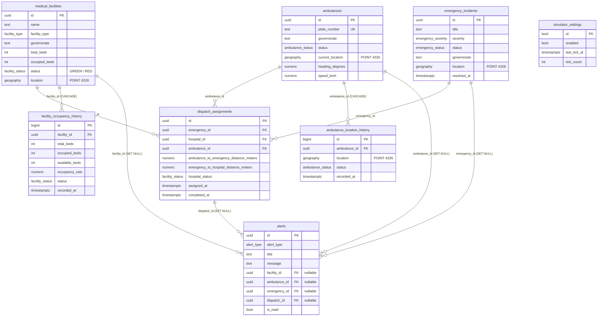

<div align="center">

# لوحة المراقبة الطبية الجغرافية في سوريا
### Syria Medical GIS Dashboard

**غرفة عمليات طبية جغرافية حيّة — المشافي وسيارات الإسعاف والحوادث الطارئة والتوجيه، في الزمن الحقيقي.**


_%2F_إنجليزي-2E7D32)

</div>

---

## 📋 نظرة عامة

مشروع **إثبات مفهوم (Proof of Concept)** جاهز للعرض، يُحاكي غرفة عمليات طبية سورية. يعرض خريطة جغرافية (GIS) حيّة للمشافي وأسطول سيارات الإسعاف والحوادث الطارئة، مع **توجيه إسعاف مدفوع من قاعدة البيانات**، ومراقبة إشغال المشافي، وإعادة تشغيل تاريخية، ودعم كامل للغتين **العربية (الافتراضية، RTL)** و**الإنجليزية (LTR)**.

يعتمد المشروع على فكرة محورية واحدة: **قاعدة البيانات هي مصدر الحقيقة الوحيد**.

> **المبدأ التصميمي:** المتصفح **لا** يحسب المسافات، و**لا** يختار سيارة الإسعاف، و**لا** يشتقّ حالة الإشغال. هو فقط يقرأ *Views* من قاعدة البيانات، ويستدعي دوال *RPC*، ويعرض النتيجة. كل المنطق الموثوق يعيش داخل PostgreSQL/PostGIS.

**أبرز ما يقدّمه:**

- 🗺️ خريطة GIS حيّة (Leaflet) مع تجميع العلامات، مشافٍ ملوّنة حسب الحالة، سيارات إسعاف متحركة، وخطوط توجيه مرسومة.
- 🚑 توجيه إسعاف تختار فيه قاعدة البيانات أقرب سيارة متاحة وتقفلها؛ وحالات الفشل تُعرَض برسائل صريحة منفصلة.
- 🏥 مراقبة إشغال المشافي بحالتَي أخضر/أحمر تُحسَبان عبر *Trigger* (`> 90%` = أحمر).
- 📡 مزامنة لحظية (Realtime) تُستخدم كإشارة "إبطال" فقط، فلا يترك انقطاع الاتصال بيانات قديمة على الشاشة.
- 🕓 إعادة تشغيل تاريخية لأي لحظة سابقة دون خلط البيانات الحيّة بالتاريخية.
- 🔁 محاكي مدمج (`pg_cron`) يُحرّك الأسطول والإشغال والحوادث كل 5 ثوانٍ.
- 🌍 واجهة ثنائية اللغة بالكامل مع أرقام وتواريخ حسب اللغة.

---

## 🧭 القرارات الهندسية (Architectural Decisions)

> يوثّق هذا القسم كيفية التوفيق بين القيود التقنية المفروضة — والتي يحتوي بعضها **تناقضات معمارية** أو **مكتبات غير موجودة** — بما يخدم الهدف الفعلي للنظام. أُعطيت الأولوية للحلّ الهندسي السليم وقابلية التشغيل على التطبيق الحرفي لمواصفات معيبة، وهذا ما يطلبه بند التسليم صراحةً.

### 1. إدارة حالة التدفّق اللحظي (Realtime State)

- **القيد المفروض:** استخدام مكتبة `react-med-geo-streamer@21` حصراً.
- **الواقع:** لا وجود لهذه المكتبة في سجلّ npm — تبعية وهمية. اختلاق أو تزييف تبعية ممارسة غير سليمة تُدخِل خطراً أمنياً حقيقياً (Dependency Confusion).
- **القرار:** إدارة حالة الخادم عبر **TanStack Query**، والتدفّق اللحظي عبر **قناة Supabase Realtime واحدة** تُستخدم كإشارة *إبطال (invalidation)*؛ فتُعاد قراءة اللقطة الموثوقة كاملةً بدل الاعتماد على تحديثات جزئية — ما يحقّق "التزامن الدقيق" وهو الهدف المعلن من القيد.

### 2. البثّ الدائم مقابل بنية Serverless

- **القيد المفروض:** بنية **Serverless كاملة على Vercel** + **اتصال TCP دائم عبر Socket.io الأصلية**.
- **التناقض:** دوال Vercel عديمة الحالة (stateless) وقصيرة العمر، ولا يمكنها استضافة خادم Socket.io ذي حالة يحافظ على اتصال دائم — الشرطان يُلغي أحدهما الآخر.
- **القرار:** استخدام **Supabase Realtime** — طبقة WebSocket مُدارة توفّر بثّاً دائماً *دون* خادم ذي حالة. بهذا نحقّق الشرطين معاً (اتصال مستمر + بنية بلا خوادم) بدل الاختيار العشوائي بينهما.

### 3. موقع منطق الأعمال (Backend)

- **القيد المفروض:** Backend على Node/Express + Serverless كامل.
- **التوتّر:** خادم Express دائم يناقض "Serverless الكامل" ويناقض "الاتصال الدائم".
- **القرار:** وضع **كامل منطق الأعمال داخل PostgreSQL عبر دوال `SECURITY DEFINER` (RPC)** — التوجيه، حساب الإشغال، اللقطات التاريخية. **قاعدة البيانات هي الـ backend**، وأي غلاف serverless يكشفها فقط. هذا القرار: يمنع الكتابة المباشرة من العميل (أمان)، ويجعل القاعدة مصدر الحقيقة الوحيد (تزامن)، ويعظّم قوة استعلامات PostGIS.

### 4. خوارزمية التوجيه وحساب السعة

- **القيد المفروض:** تحويل مخطط `routing_algorithm_diagram.png` حرفياً، مع منع "الاجتهاد الشخصي".
- **القرار:** نُفّذت القاعدة المتّسقة صراحةً داخل القاعدة: الإشغال `> 90%` ⇐ `RED` وإلا `GREEN`، واختيار **أقرب سيارة إسعاف متاحة** للحادث عبر بحث الجار الأقرب (KNN). أي تناقض داخل المخطط المرجعي يُوثَّق ويُعالَج بدل استنساخه، تفادياً لبناء منطق معيب عن قصد.

### 5. إطار الواجهة الأمامية

- **القيد المفروض:** React.js أو Next.js.
- **القرار:** **TanStack Start** — إطار React 19 حديث بتصيير من الخادم (SSR)، يقع ضمن منظومة React ويحقّق روح القيد، مع توجيه وطبقة بيانات أقوى ملائمة للوحات التشغيلية.

### 6. قاعدة البيانات

- **القيد المفروض:** PostgreSQL + PostGIS.
- **القرار:** التزام كامل — أعمدة `geography(Point,4326)`، فهارس GiST، بحث KNN عبر `<->`، ودوال `ST_Distance`/`ST_X`/`ST_Y` داخل *Views*. هذا هو المحور الذي بُني عليه النظام كلّه.

> **الخلاصة:** حيثما كان القيد سليماً (PostGIS، الفلترة، السجل الزمني، التنبيهات، التوجيه اليدوي) طُبّق بالكامل؛ وحيثما كان مستحيلاً أو متناقضاً (مكتبة وهمية، Serverless مع اتصال دائم) وُثّق البديل ومُبرّره. الالتزام هنا بالهدف لا بالحرف.

---

## 🗃️ مخطط قاعدة البيانات (ERD)

قاعدة البيانات هي قلب المشروع. تتكوّن من **8 جداول** (5 أساسية + جدولا تاريخ + جدول إعدادات المحاكي)، وتُغلَّف بـ *Views* ودوال *RPC* تستهلكها الواجهة.

> يُعرَض المخطط تلقائياً بشكل رسومي على GitHub (Mermaid).



### ملاحظات على العلاقات

- **`dispatch_assignments`** هو الجدول المحوري: يربط حادثاً (`emergency_id`) بمشفى (`hospital_id`) وسيارة إسعاف (`ambulance_id`)، مع `ON DELETE RESTRICT` لمنع حذف كيان مرتبط بتوجيه.
- **قيدان فريدان جزئيان** يضمنان تعييناً نشطاً واحداً فقط لكل حادث ولكل سيارة إسعاف (حيث `completed_at IS NULL`).
- **جداول التاريخ** (`*_history`) تُكتب تلقائياً عبر Triggers عند كل تغيير، وترتبط بجداولها الأصلية بـ `ON DELETE CASCADE`.
- **`alerts`** يربط اختيارياً بأربعة كيانات (مفاتيح أجنبية nullable مع `ON DELETE SET NULL`) لأن التنبيه قد يخصّ أياً منها.
- **`simulator_settings`** جدول أحادي الصف (مفتاحه `boolean` دائماً `true`) يحمل حالة المحاكي.

### الكائنات المشتقّة (Views + RPC)

| النوع | الاسم | الغرض |
| --- | --- | --- |
| View | `medical_facilities_map` | إحداثيات جاهزة (`ST_X`/`ST_Y`) + الأسرّة المتاحة ونسبة الإشغال |
| View | `ambulances_map` | إحداثيات الإسعاف الجاهزة + الحالة والسرعة والاتجاه |
| View | `emergency_incidents_map` | إحداثيات الحوادث الجاهزة |
| View | `dispatch_assignments_details` | تفاصيل التوجيه مع أسماء المشفى/الحادث ولوحة الإسعاف |
| RPC | `process_emergency_routing()` | يقفل أقرب إسعاف متاح، يكتب التوجيه، يحدّث الحالات، يطلق التنبيهات |
| RPC | `complete_dispatch()` | إنهاء توجيه وتحرير سيارة الإسعاف |
| RPC | `get_historical_snapshot()` | لقطة زمنية من جداول التاريخ |
| RPC | `mark_alert_read()` | تعليم تنبيه كمقروء |
| RPC | `simulate_tick()` / `set_simulator_enabled()` | نبضة المحاكاة والتحكّم بها |

---

## 🗂️ هيكل المشروع

```
syria-med-map-main/
│
├── src/                                  # الشيفرة المصدرية
│   │
│   ├── components/                       # مكوّنات واجهة المستخدم
│   │   ├── ui/                           # مكوّنات shadcn-ui الأساسية (زر، بطاقة، حوار، تبويبات…)
│   │   └── map/                          # مكوّنات الخريطة
│   │       ├── MapPanel.tsx              # غلاف الخريطة (يُحمَّل على العميل فقط)
│   │       ├── OpsMap.tsx                # خريطة العمليات: العلامات، التجميع، خطوط التوجيه، التركيز
│   │       └── markerIcons.ts            # أيقونات العلامات (مشفى / إسعاف / حادث) حسب الحالة
│   │
│   ├── routes/                           # مسارات التطبيق (TanStack Router)
│   │   ├── __root.tsx                    # الغلاف الجذري: قالب HTML، المزوّدات، حدود الأخطاء وصفحة 404
│   │   └── index.tsx                     # اللوحة الرئيسية: KPIs، الفلاتر، الخريطة، لوحة العمليات، التوجيه
│   │
│   ├── services/                         # الطبقة الوحيدة التي تتحدث مع قاعدة البيانات
│   │   ├── supabase.ts                   # عميل Supabase المشترَك
│   │   ├── medical.service.ts            # قراءة الـ Views + تجميع لقطة اللوحة
│   │   ├── dispatch.service.ts           # process_emergency_routing / complete_dispatch
│   │   ├── history.service.ts            # get_historical_snapshot
│   │   └── simulator.service.ts          # قراءة حالة المحاكي وتفعيله/إيقافه
│   │
│   ├── integrations/supabase/            # التكامل مع Supabase
│   │   ├── client.ts                     # عميل جهة العميل (المتصفح)
│   │   ├── client.server.ts              # عميل جهة الخادم (SSR)
│   │   ├── auth-middleware.ts            # وسيط التحقق من رموز المصادقة على الخادم
│   │   ├── auth-attacher.ts              # إرفاق رمز المصادقة بالطلبات
│   │   └── types.ts                      # أنواع قاعدة البيانات المولّدة تلقائياً
│   │
│   ├── hooks/                            # الخطّافات (React Hooks)
│   │   ├── useMedicalRealtime.ts         # قناة Realtime واحدة + حالة اتصال + إعادة مزامنة كاملة
│   │   └── use-mobile.tsx                # كشف شاشة الجوال
│   │
│   ├── i18n/                             # الترجمة وتعدّد اللغات
│   │   ├── index.tsx                     # مزوّد اللغة: التبديل، الاتجاه (RTL/LTR)، تنسيق الأرقام والتواريخ
│   │   └── translations.ts              # النصوص المترجمة (عربي / إنجليزي) وأسماء المحافظات
│   │
│   ├── lib/                              # أدوات ومساعدات
│   │   ├── medical-utils.ts              # تصفية المشافي/الإسعاف/الحوادث وحساب مسافات العرض
│   │   ├── utils.ts                      # أدوات عامة (دمج أصناف Tailwind…)
│   │   ├── error-capture.ts              # التقاط الأخطاء الأصلية لاسترجاعها في SSR
│   │   ├── error-page.ts                 # توليد صفحة الخطأ عند فشل الخادم
│   │   └── lovable-error-reporting.ts    # إعادة توجيه أخطاء الحدود لتتبّع Lovable (لا يفعل شيئاً خارج المحرّر)
│   │
│   ├── types/
│   │   └── medical.ts                    # عقود الأنواع لصفوف الجداول وحمولات RPC
│   │
│   ├── router.tsx                        # إنشاء الموجّه وربط QueryClient
│   ├── routeTree.gen.ts                  # شجرة المسارات المولّدة تلقائياً (لا تُعدَّل يدوياً)
│   ├── server.ts                         # غلاف SSR الذي يلتقط الأخطاء
│   ├── start.ts                          # نقطة انطلاق TanStack Start
│   └── styles.css                        # أنماط Tailwind العامة ومتغيّرات الثيم
│
├── supabase/                             # قاعدة البيانات
│   ├── config.toml                       # إعداد مشروع Supabase
│   └── migrations/                       # ملفات الهجرة (تُطبَّق بترتيب أسمائها)
│       ├── …_1002_….sql                  # المخطط الأساسي: الجداول، الأنواع، الفهارس، Triggers، RLS، Realtime
│       ├── …_1059_….sql                  # الـ Views ودوال RPC (التوجيه، الإكمال، التنبيهات، اللقطة التاريخية)
│       ├── …_4822_….sql                  # جدول إعدادات المحاكي + simulate_tick + جدولة pg_cron
│       └── …_5530_….sql                  # تحديث دالة process_emergency_routing
│
├── public/                              # ملفات ثابتة (favicon، robots.txt)
│
├── package.json                         # التبعيات وأوامر التشغيل
├── vite.config.ts                       # إعداد Vite/SSR (عبر حزمة Lovable) — يوجّه دخول الخادم لـ src/server.ts
├── tsconfig.json                        # إعداد TypeScript (وضع صارم + مسار الاختصار @/*)
├── eslint.config.js                     # قواعد ESLint + Prettier
├── components.json                      # إعداد shadcn/ui
├── .env                                 # متغيّرات البيئة (رابط Supabase والمفتاح العلني)
└── README.md                            # هذا الملف
```

---

## 🛠️ التقنيات المستخدمة

| الطبقة | التقنية |
| --- | --- |
| الواجهة | React 19، TanStack Router / Start (تصيير من الخادم SSR)، Vite 8، TypeScript |
| التنسيق | Tailwind CSS v4، shadcn/ui (مبنية على Radix)، أيقونات Lucide |
| الخرائط | Leaflet، react-leaflet، react-leaflet-cluster |
| البيانات والحالة | TanStack Query، عميل Supabase |
| الواجهة الخلفية | PostgreSQL 15 + PostGIS 3.3، Supabase (Realtime، RPC، RLS) |
| اللغات | مزوّد i18n خفيف مخصّص (عربي RTL افتراضي + إنجليزي LTR) |
| جودة الكود | ESLint + Prettier + TypeScript (وضع صارم) |

> **ملاحظة حول البناء:** منظومة البناء (Vite/SSR) مُجمّعة عبر حزمة `@lovable.dev/vite-tanstack-config` (انظر [`vite.config.ts`](vite.config.ts)). هذه الحزمة تربط TanStack Start و Nitro و Tailwind ومسارات الاستيراد وحقن متغيّرات البيئة، وهي **مطلوبة** لكي يعمل المشروع ويُبنى.

### 🔄 إدارة الحالة (State Management)

- **حالة الخادم (Server State):** تُدار عبر **TanStack Query**. لقطة اللوحة (`fetchDashboardSnapshot`) تُجلَب كاستعلام واحد، وحالة المحاكي كاستعلام دوري كل 15 ثانية.
- **المزامنة اللحظية:** خطّاف [`useMedicalRealtime`](src/hooks/useMedicalRealtime.ts) يفتح **قناة Realtime واحدة مشتركة**، ويستخدم أحداث التغيير كإشارة **إبطال (invalidation)** فقط — ثم يُعيد جلب اللقطة الموثوقة كاملةً. بهذا لا يمكن لتحديث جزئي أو انقطاع مؤقت أن يترك حالة غير متسقة.
- **إعادة المزامنة عند إعادة الاتصال:** عند عودة الاتصال تُقرأ اللقطة الكاملة من جديد، فتُصحَّح أي أحداث فاتت أثناء الانقطاع.
- **الحالة المحلية للواجهة:** الفلاتر، العنصر المُركَّز عليه، الوضع التاريخي، وحالة التوجيه تُدار بـ `useState` داخل [`index.tsx`](src/routes/index.tsx).
- **فصل الطبقات:** المكوّنات لا تلمس قاعدة البيانات مباشرة إطلاقاً؛ كل الوصول يمرّ عبر مجلّد [`src/services/`](src/services/).

### 🔐 الأمان والحماية

- **مفتاح علني فقط في المتصفح:** يصل فقط المفتاح العلني (anon) عبر `VITE_SUPABASE_PUBLISHABLE_KEY`. **لا يوجد** مفتاح `service-role` في الواجهة الأمامية إطلاقاً.
- **أمان مستوى الصف (Row Level Security):** مُفعّل على **كل** الجداول العامة. لا يوجد تسجيل دخول في هذا الـ PoC، فلكل جدول سياسة قراءة واحدة فقط (`SELECT`) لـ `anon` / `authenticated`.
- **لا كتابة مباشرة من العميل:** كل التعديلات تمرّ حصراً عبر دوال `SECURITY DEFINER` (RPC). لا يقبل أي جدول كتابةً مباشرة من العميل، ما يمنع التلاعب بالبيانات.
- **حماية المحاكي:** `simulate_tick()` غير قابل للاستدعاء من `anon`؛ مُجدوِل `pg_cron` وحده يشغّله.
- **سلامة البيانات على مستوى القاعدة:** قيود `CHECK` (سعة الأسرّة، نطاق الاتجاه، اتساق التوقيتات)، ومفاتيح أجنبية بسلوك حذف صريح (`RESTRICT` / `CASCADE` / `SET NULL`)، وقيود فريدة جزئية تمنع تعييناً مزدوجاً لسيارة إسعاف واحدة.
- **معالجة أخطاء صريحة:** أخطاء التوجيه تُصنَّف وتُعرَض للمستخدم برسائل منفصلة (لا إسعاف متاح / الحادث غير نشط / غير موجود / تحقّق / شبكة).

---

## 🚀 التشغيل محلياً

### المتطلّبات المسبقة

- **Node.js 20+** (أو **Bun 1.1+** بما يوافق ملف `bun.lock`)
- مشروع **Supabase / PostgreSQL 15 + PostGIS**

### 1) تثبيت الحزم

```bash
npm install
```

### 2) إعداد متغيّرات البيئة

أنشئ ملف `.env` في جذر المشروع (يصل المفتاح العلني فقط إلى المتصفح):

```env
VITE_SUPABASE_URL=https://<your-project>.supabase.co
VITE_SUPABASE_PUBLISHABLE_KEY=sb_publishable_xxx
VITE_SUPABASE_PROJECT_ID=<your-project-id>
```

### 3) تطبيق قاعدة البيانات

نفّذ ملفات SQL في `supabase/migrations/` بترتيب أسمائها (حسب الطابع الزمني) على مشروع Supabase/PostgreSQL.

### 4) الأوامر

```bash
npm run dev      # تشغيل خادم التطوير
npm run build    # بناء نسخة الإنتاج
npm run preview  # معاينة نسخة الإنتاج
npm run lint     # فحص الكود
npm run format   # تنسيق الكود
```

---

## 📐 قاعدة الإشغال

```
نسبة الإشغال = (الأسرّة المشغولة ÷ إجمالي الأسرّة) × 100

النسبة > 90   →  RED (أحمر)
النسبة <= 90  →  GREEN (أخضر)
```

تتضمّن بيانات العرض عمداً مشفىً عند **90.00% بالضبط** (`مشفى دمشق المركزي`) يجب أن يظهر **أخضر**، ومشافٍ عند `91.43 / 92.00 / 94.29%` يجب أن تظهر **حمراء** — للتحقق من أن الحدّ يُفرَض في قاعدة البيانات لا في الواجهة.

---

## 🔁 المحاكي

`public.simulate_tick()` يعمل كل 5 ثوانٍ عبر `pg_cron` (المهمة `syria-gis-simulator`). في كل نبضة:

1. يُحرّك كل سيارة إسعاف في الخدمة خطوة عشوائية صغيرة ويغيّر السرعة/الاتجاه (فيكتب سجل الموقع ويُطلق أحداث Realtime)؛
2. يُعدّل إشغال مشفى عشوائي بمقدار −3..+3 أسرّة ويُعيد تقييم أخضر/أحمر ويطلق تنبيهات الإشغال العالي؛
3. باحتمال ~18% ينشئ حادثاً جديداً قرب مشفى (بحدّ أقصى 8 حوادث نشطة)؛
4. باحتمال ~15% يُكمل توجيهاً قديماً مفتوحاً ويحرّر سيارته؛
5. يحذف السجلات والتنبيهات الأقدم من ساعتين ليبقى حجم قاعدة العرض صغيراً.

يمكن التحكّم به من رأس اللوحة، أو من SQL:

```sql
select public.set_simulator_enabled(false);  -- إيقاف
select public.set_simulator_enabled(true);   -- تشغيل
select * from public.simulator_settings;     -- enabled, last_tick_at, tick_count
```

---

## 🧭 أوضاع التشغيل

**الوضع الحيّ (الافتراضي):** قناة Realtime فعّالة، وإجراءات التوجيه والتنبيهات مُفعّلة. حالة الاتصال مرئية دائماً في الرأس (يتصل / متصل / يعيد الاتصال / منقطع).

**الوضع التاريخي:** اختر تاريخاً ووقتاً واضغط "تحميل". تعرض اللوحة نتيجة `get_historical_snapshot` فقط — يُلغى اشتراك Realtime وتُخفى إجراءات التوجيه والإكمال والتنبيهات. لافتة دائمة تُظهر وقت اللقطة مع زرّ للعودة الفورية إلى الوضع الحيّ.

---

## 🚑 تدفّق التوجيه

1. اختر حادثاً نشطاً من لوحة العمليات.
2. اختر المشفى المستقبِل (القائمة مرتّبة حسب الأسرّة الحرّة).
3. اضغط "توجيه" — الزرّ مُعطَّل أثناء التنفيذ وحتى اختيار مشفى، فلا يستطيع المشغّل الإرسال مرتين.
4. `process_emergency_routing()` يقفل أقرب سيارة إسعاف متاحة، ويكتب صفّ التوجيه، ويحدّث حالتي الإسعاف والحادث، ويطلق التنبيهات.
5. ترسم الخريطة المسارين: إسعاف ← حادث (أزرق)، وحادث ← مشفى (أخضر)، ويعرض الشريط اللوحة والمشفى والمسافة.

تُعرَض حالات الفشل صراحةً: **لا إسعاف متاح**، **الحادث لم يعد نشطاً**، **غير موجود**، **خطأ تحقّق**، و**خطأ شبكة** — لكلٍّ رسالته الخاصة.

---

## 🎬 سيناريو العرض (≈ 3 دقائق)

1. افتح اللوحة بالعربية — لاحظ تخطيط RTL، صفّ المؤشّرات KPI، ومؤشّر "متصل" الأخضر.
2. راقب انجراف سيارات الإسعاف وتغيّر مؤشّرات الإشغال دون أي تحديث.
3. صفِّ حسب المحافظة وحسب الحالة الحمراء؛ انقر مشفىً لتطير الخريطة إليه.
4. افتح تبويب الحوادث، اختر حادثاً ومشفىً ووجّه — أظهر اللوحة المُعيَّنة والمسارين والتنبيه الجديد.
5. أكمِل التوجيه وأظهر عودة سيارة الإسعاف إلى "متاح".
6. بدّل إلى الإنجليزية (LTR)، ثم حمّل لقطة تاريخية من قبل 10 دقائق — أشِر إلى تعطّل التوجيه وظهور اللافتة.
7. عُد إلى الوضع الحيّ.

---

## 📌 حالة المشروع

إثبات مفهوم (PoC) جاهز للعرض. غير مُهيّأ للإنتاج من حيث المصادقة، والتحكّم متعدّد المستأجرين بالوصول، أو النشر عالي التوفّر.
